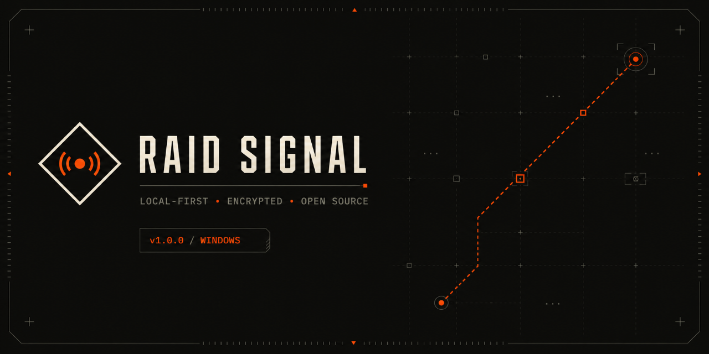
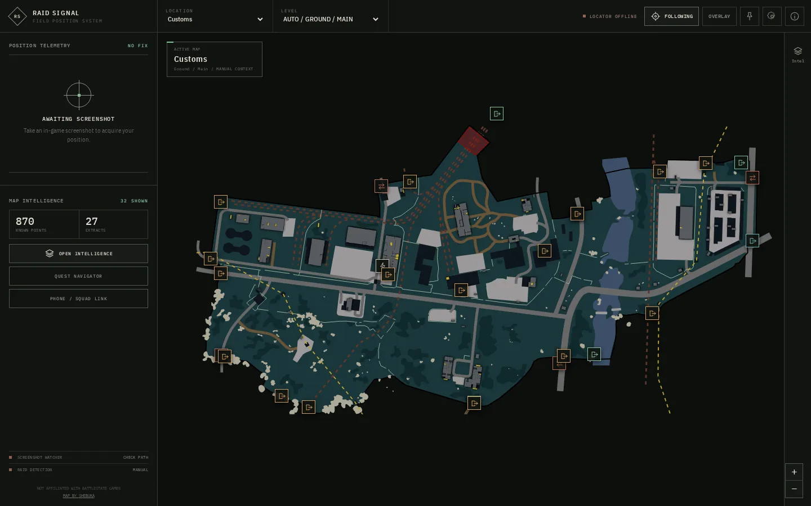

# Raid Signal

Local-first Escape from Tarkov map intelligence and end-to-end encrypted squad
position sharing for Windows.

[](https://github.com/QTtrash/tarkov-map/releases/latest)
[](https://github.com/QTtrash/tarkov-map/actions/workflows/ci.yml)
[](https://github.com/QTtrash/tarkov-map/actions/workflows/security.yml)
[](LICENSE)
[](https://github.com/QTtrash/tarkov-map/releases)



> **License boundary:** Raid Signal's original source code is Apache-2.0. Bundled
> community map artwork and game-data snapshots are separately licensed and
> include noncommercial or usage restrictions. Read [the asset ledger](ASSET_LICENSES.md)
> before redistributing the complete application.

Raid Signal passively observes screenshot filenames and application logs written
by Tarkov. It does not read game memory, inject input, automate play, or modify
game files. No official approval or anti-cheat guarantee is implied.

## Features



- Native Tauri desktop map and compact always-on-top overlay.
- Screenshot coordinate parsing, raid/map detection, floors, POIs, extracts,
  quests, and local custom waypoints.
- Three-hour Internet invitations and same-Wi-Fi LAN sessions.
- AES-256-GCM position updates with a fresh nonce and room-bound authenticated
  data; invitation keys remain in URL fragments and never reach the relay.
- Hosted phone companion that decrypts and renders positions locally.
- No telemetry, account integration, relay message history, or cloud quest/pin
  storage.

## Install and verify

Download the Windows installer and SHA-256 file from the immutable
[v1.0.0 release](https://github.com/QTtrash/tarkov-map/releases/tag/v1.0.0).
Installers are unsigned initially, so Windows may display an unknown-publisher
warning. Do not download installers from repository commits or third-party mirrors.

Verify the checksum in PowerShell from the directory containing both downloads:

```powershell
$expected = (Get-Content .\Raid-Signal-Setup-1.0.0.exe.sha256).Split()[0]
$actual = (Get-FileHash .\Raid-Signal-Setup-1.0.0.exe -Algorithm SHA256).Hash.ToLowerInvariant()
if ($actual -ne $expected) { throw "Raid Signal checksum mismatch" }
```

With the GitHub CLI installed, verify that GitHub Actions produced the artifact:

```text
gh attestation verify Raid-Signal-Setup-1.0.0.exe -R QTtrash/tarkov-map
```

The release also contains `release.json` and an SPDX SBOM. The
[v1.0.0 release workflow](https://github.com/QTtrash/tarkov-map/actions/runs/31826345419)
records the successful build, Microsoft Defender scan, independent ClamAV scan,
and publication gate. These controls provide traceable release evidence; they
are not a third-party security audit or anti-cheat approval.

## Build and verify

Requirements are Node 22.18, npm 11.14, Rust 1.93, and the current
[Tauri Windows prerequisites](https://v2.tauri.app/start/prerequisites/).

```text
npm ci
npm --prefix relay ci
npm run check:all
npm run tauri:dev
```

Useful commands:

| Command                 | Purpose                                        |
| ----------------------- | ---------------------------------------------- |
| `npm run dev`           | Browser preview on port 1420                   |
| `npm run tauri:dev`     | Native Windows development app                 |
| `npm test`              | Frontend/domain unit tests                     |
| `npm run test:e2e`      | Playwright critical user journeys              |
| `npm run assets:verify` | Verify bundled hashes and intelligence bundles |
| `npm run check:all`     | Required local and CI quality gate             |

## System shape

```text
Tarkov-created files -> Rust watcher/parsers -> validated Tauri events -> desktop UI
                                                               |
                                                               v
                                                     AES-GCM ciphertext
                                                               |
                                      Node Internet relay or native LAN relay
                                                               |
                                                               v
                                               desktop / phone companion
```

The Node relay serves the landing page and companion, enforces bounded rooms,
connections, payloads, and message rates, and forwards ciphertext only. It never
receives the fragment key or parses position messages. Installers are hosted only
as GitHub Release assets. See [architecture](docs/ARCHITECTURE.md),
[security model](docs/SECURITY.md), and [VPS deployment](docs/DEPLOYMENT.md).

## Privacy limitations

The relay can observe connection IP addresses, timing, and room activity even
though it cannot decrypt messages. Anyone with an invitation can view the room,
and a modified client holding the key can forge a position. Treat invitations as
secrets and use LAN mode only on a trusted network.

## Contributing and support

Read [AGENTS.md](AGENTS.md) for repository navigation and [CONTRIBUTING.md](CONTRIBUTING.md)
for the development workflow. Use GitHub Issues for reproducible defects and
scoped implementation work, Discussions Q&A for setup and usage help,
Discussions Ideas for product suggestions, the community Discord for informal
help, and private vulnerability reporting for security issues. The
[Code of Conduct](CODE_OF_CONDUCT.md) applies to all project spaces.
Read the [privacy policy](PRIVACY.md) for the desktop, Internet relay, and LAN
sharing boundaries.

## Licensing and attribution

- Original Raid Signal code and documentation: [Apache-2.0](LICENSE).
- SVG maps and RE3MR-derived raster maps: CC BY-NC-SA 4.0 plus the source-specific
  conditions recorded in [ASSET_LICENSES.md](ASSET_LICENSES.md).
- Tarkov.dev metadata: MIT; data/API terms remain upstream-controlled.
- Complete notices: [THIRD_PARTY_NOTICES.md](THIRD_PARTY_NOTICES.md) and [NOTICE](NOTICE).

Escape from Tarkov and related materials are property of their respective owners.
Raid Signal is independent and not endorsed by Battlestate Games, Tarkov.dev, or
the community map authors.
